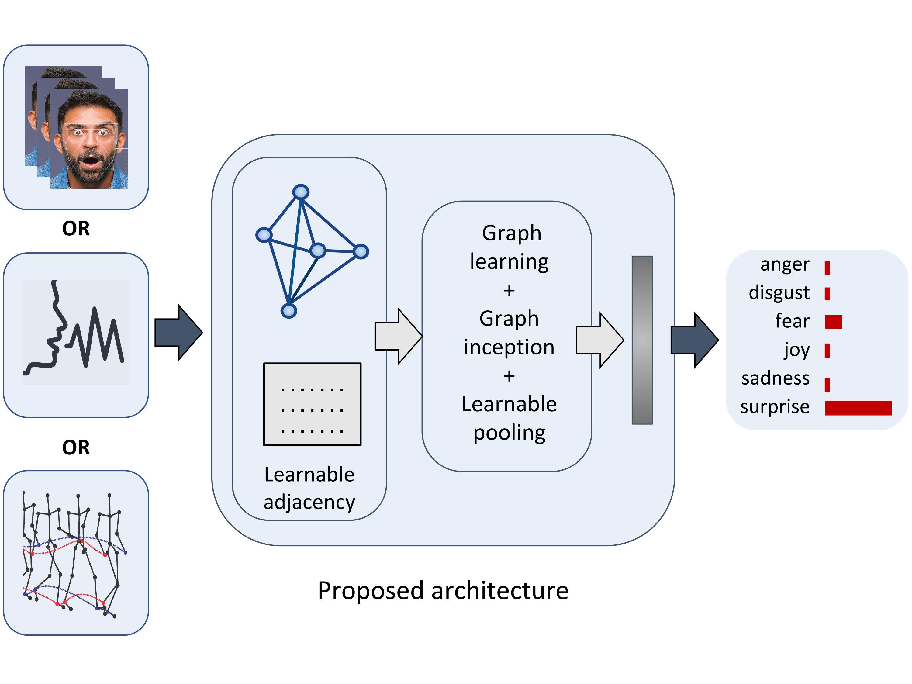

# Dynamic Emotion Modeling with Learnable Graphs and Graph Inception Network

<br>

**Jan 11, 2021**
* First release of the project.

<br>


<center><b>Figure</b>: Qualitative results showing the node (frame) for a graph input that generated the strongest response in our network</center>



## 1. Dependency installation

The code was successfully built and run with these versions:

```
pytorch-gpu 1.2.0
cudnn 7.6.4
cudatoolkit 10.0.130
opencv 3.4.2
scikit-learn 0.21.2
face_alignment 1.0.1 (for preprocessing)

```
Note: You can also create the environment I've tested with by importing _environment.yml_ in conda.


<br>

## 2. Preprocessing Data

The process for RML database is in preprocess directory. The process converts the database into one txt file including graph structure and node attributes.


<br>

## . Reference 

[ArXiv's paper](https://arxiv.org/pdf/2008.02661.pdf)
```
@article{shirian2020learnable,
  title={Learnable Graph Inception Network for Emotion Recognition},
  author={Shirian, Amir and Tripathi, Subarna and Guha, Tanaya},
  journal={arXiv preprint arXiv:2008.02661},
  year={2020}
}
```


<br><br><br>
