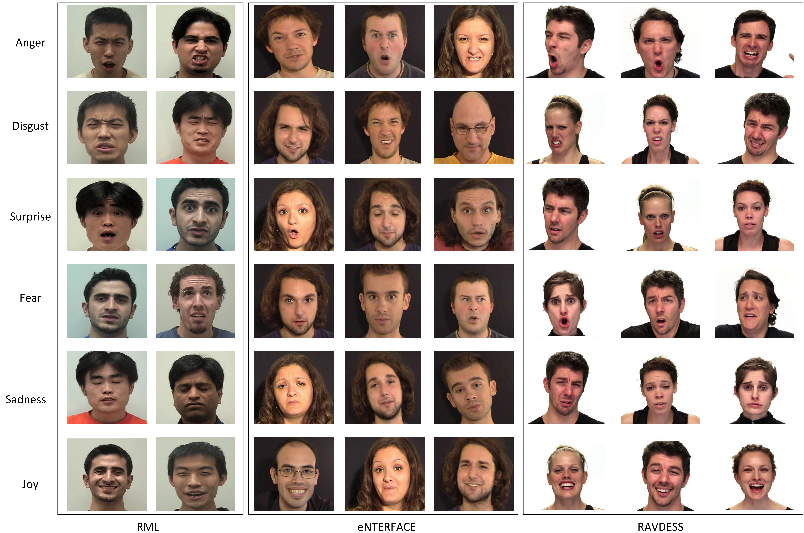

# Dynamic Emotion Modeling with Learnable Graphs and Graph Inception Network

<br>

**Jan 11, 2021**
* First release of the project.

<br>


<center><b>Figure</b>: Qualitative results showing the node (frame) for a graph input that generated the strongest response in our network</center>


<br>

## 8. Reference 

[ArXiv's paper](https://arxiv.org/pdf/2008.02661.pdf)
```
@article{shirian2020learnable,
  title={Learnable Graph Inception Network for Emotion Recognition},
  author={Shirian, Amir and Tripathi, Subarna and Guha, Tanaya},
  journal={arXiv preprint arXiv:2008.02661},
  year={2020}
}
```


<br><br><br>
